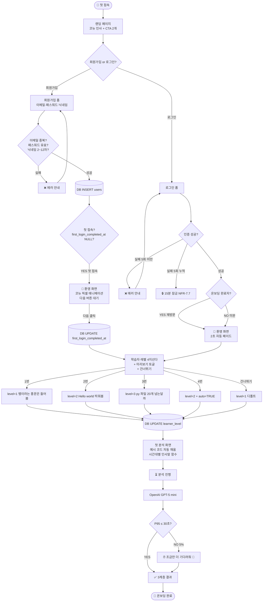
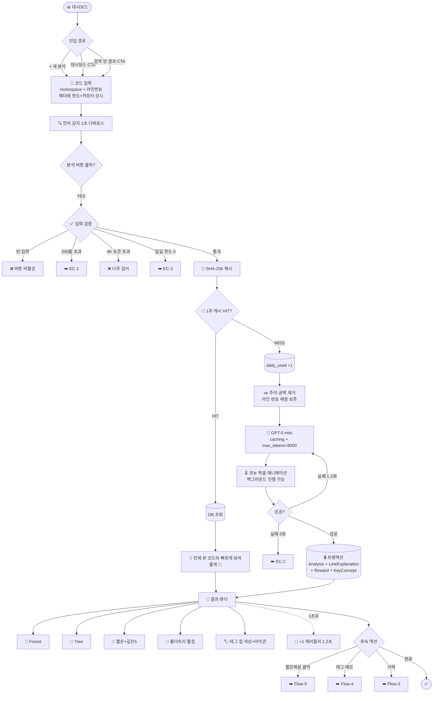
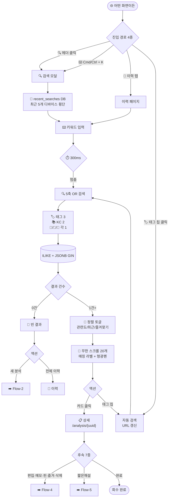
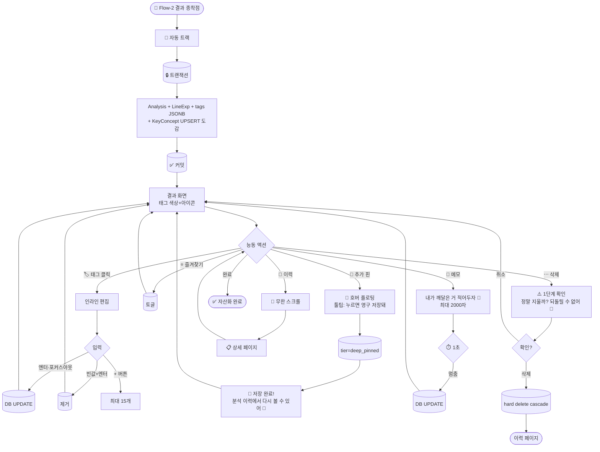
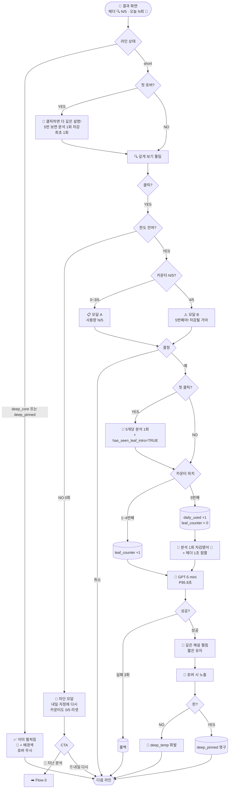
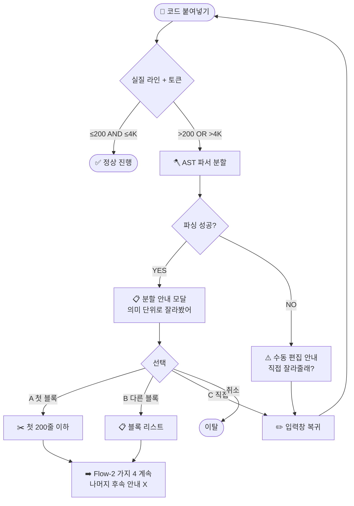
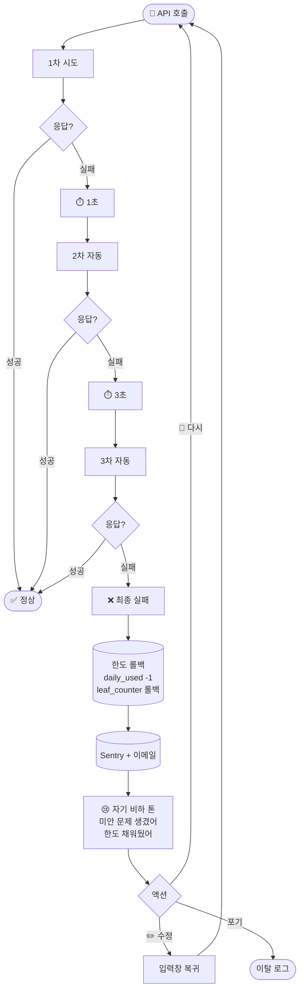
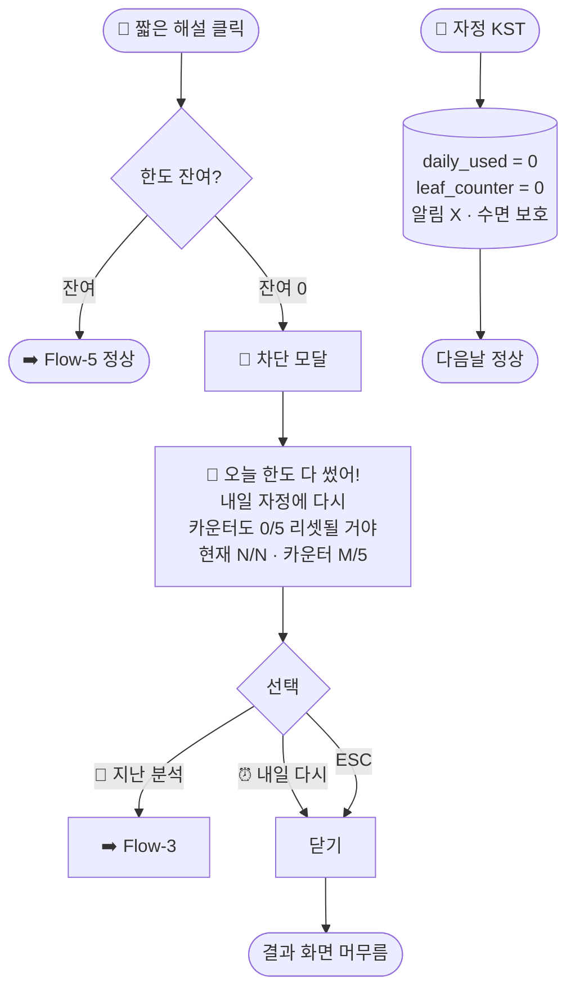
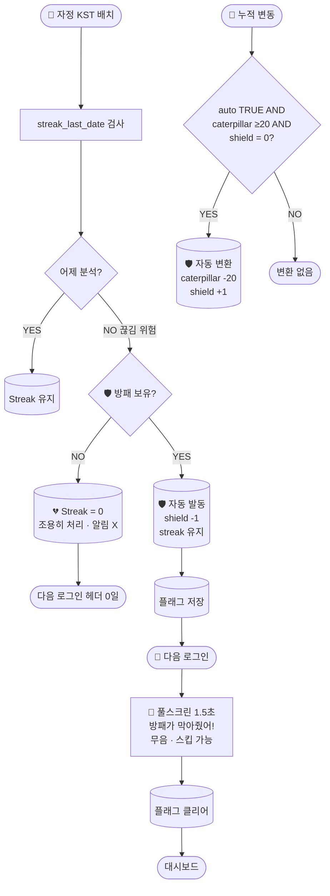
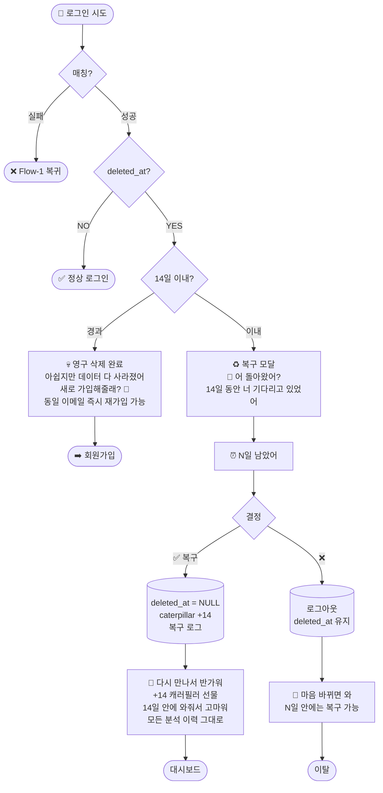

# Code Decoder MVP — Stage 3 UX Flow

> **문서 상태**: Stage 3 통합 완료본
> **버전**: v0.2
> **작성일**: 2026-05-15
> **참조 SSoT**: `01-discovery-summary-v2.md`, `02-PRD.md`
> **부속 자료**: `03-ux-flow-diagrams.pdf` (Mermaid 다이어그램 10개 시각화, A4 10페이지)
> **소유자**: 코뉴(제품 오너)

---

## 패치 이력 (Patch Log)

| 일자 | 버전 | 변경 내용 |
|---|---|---|
| 2026-05-15 | v0.1 | Stage 3 통합 완료본 (Flow 5종 + EC 5종 + 마이크로 결정 32) |
| 2026-05-17 | v0.2 | **3계층 명칭 통일** — `Branch` → `Leaf`. Flow-5 명칭 `Branch 확장` → `Leaf 확장`. 기술 식별자 `branch_counter`→`leaf_counter`, `has_seen_branch_intro`→`has_seen_leaf_intro` 동반 변경(§13.3 DB 스키마 표 포함). 다이어그램 라인별 해설 노드 이모지 📄→🍃. PRD v0.4와 동기화. |

> **참고**: §7.3 "선택지 3가지"·EC-1 다이어그램 "Flow-2 가지 4"의 `가지`는 3계층 메타포가 아닌 일반어(일반 단계 지칭)이므로 의도적으로 보존함.

---

## §0. Document Meta

본 문서는 Code Decoder MVP의 **9단계 워크플로우 중 Stage 3** 산출물이며, Stage 2 PRD(`02-PRD.md`)에서 정의된 **Top Use Cases 3종(UC-1·UC-2·UC-3)과 FR 87개**를 사용자 흐름(user flow) 관점에서 시각화한다. Stage 4 Design 1차의 와이어프레임(wireframe) 입력 자료가 된다.

### 본 문서를 읽는 모든 Claude 인스턴스가 따라야 할 룰

1. **컨텍스트 우선순위**: Discovery v2 → PRD → 본 UX Flow → 사용자 즉시 발화. 충돌 시 상위 문서가 우선.
2. **마이크로 결정(micro-decision) 32개**: 본 문서에 각 Flow/EC 섹션에 분산되어 명시됨. PRD v0.3 minor 갱신 시 §13 패치 영향 통합표를 SSoT로 참조.
3. **Mermaid v11 안전 문법 강제**: 모든 노드 라벨은 큰따옴표 `"..."`로 감싸기. 그렇지 않으면 v11에서 깨짐.
4. **TDD 약자 충돌 주의**: Stage 7 = **TDDoc**(Technical Design Document) / Stage 9 = **TDDev**(Test-Driven Development).

---

## §1. Stage 3 Executive Summary

### Pre-MVP 핵심 사용자 흐름 5종

| Flow | 본질 | UC 매핑 | 사용 빈도 |
|---|---|---|---|
| **Flow-1 온보딩** | 첫 만남에서 첫 도파민까지 P95 30초 도달 | 신규 가입 | 1회/계정 |
| **Flow-2 즉시 해설** | "막힌 코드 → 30초 안에 이해" | **UC-1** | 매일 1~10회 |
| **Flow-3 누적 검색** | "전에 본 그거 뭐였더라?" 1초 회수 | **UC-2** | 매주 N회 |
| **Flow-4 태깅·아카이브** | 분석을 학습 자산으로 능동 전환 | (UC-2 입력) | 분석마다 가변 |
| **Flow-5 Leaf 확장** | 라인 단위 깊은 학습 + 5:1 페널티 게이트 | UC-1 확장 | 분석마다 1~5회 |

### Edge Case 5종

| EC | 본질 | 발동 위치 |
|---|---|---|
| **EC-1** | 200줄 초과 → AST 의미 단위 분할 폴백 | Flow-2 검증 단계 |
| **EC-2** | 분석 실패 3회 → 한도 롤백 + 운영자 알림 | Flow-2/5 실행 단계 |
| **EC-3** | 한도 0회 + 추가 Leaf 시도 → 단순 차단 | Flow-5 차단 모달 |
| **EC-4** | Streak 끊김 + 방패 보유 → 자동 발동 | 자정 KST 배치 |
| **EC-5** | 14일 유예 중 재로그인 → 자동 복구 | Flow-1 인증 |

### Stage 3에서 결정된 마이크로 결정 32개 총괄

| 시리즈 | 갯수 | 범위 |
|---|---|---|
| ① Flow-1 | 3개 | 환영/미리보기/예시코드 |
| ② Flow-2 | 4개 | 캐시토스트/백그라운드/보상타이밍/폴더트리 |
| ③ Flow-3 | 4개 | 단축키/검색어DB저장/페이지네이션/정렬토글 |
| ④ Flow-4 | 4개 | 색상+아이콘/디바운스/삭제확인/핀호버 |
| ⑤ Flow-5 | 4개 | 카운터위치/차감피드백/차단CTA/이미본라인 |
| ⑥ EC 1~5 | 9개 | EC별 1~2개 |
| 추가 | 4개 | 핀안내·카운터리셋·첫사용안내·이용가이드 |
| **합계** | **32개** | PRD §13 패치 영향 통합표 참조 |

---

## §2. Flow-1 온보딩

### §2.1 본질
**첫 만남이 곧 운명**. 코뉴 페르소나는 ADHD + "AI한테 또 졌다" 트라우마를 안고 우리 앱에 도착한다. P95 30초 내 첫 결과 도달이 이탈률을 80% 결정한다. PRD §12.1 Done 정의의 핵심 KPI.

### §2.2 5단계 주요 흐름

| # | 단계 | 평균 소요 | 핵심 비밀 |
|---|---|---|---|
| 1 | 랜딩 | 5초 | 카피라이팅이 이탈 방지 |
| 2 | 인증 | 30초 | 회원가입 vs 로그인 분기 |
| 3 | 환영 | 3초 (재방문) / 가변 (첫 접속) | **첫 접속은 [다음] 버튼 필수, 재방문은 2초 자동** |
| 4 | 레벨 선택 | 10초 | 4지선다 + 미리보기 토글 + 건너뛰기 |
| 5 | 첫 분석 | 30초 (P95) | 예시 코드 자동 채움 |

### §2.3 마이크로 결정 (Flow-1)

#### ①-1. 환영 화면 노출 시간 — **첫 접속은 [다음] 클릭, 재방문은 2초 자동**
**사유**: HSP 페르소나 관점에서 첫 만남은 "관계 형성(rapport building)" 디자인. 사용자가 코뉴와 첫 인사를 능동적으로 마치는 행위가 친밀감 형성에 결정적. 재방문은 이미 친한 친구이므로 자동 페이드.

**구현**: `users.first_login_completed_at` 컬럼으로 분기. NULL이면 첫 접속(버튼 대기), 값 있으면 재방문(2초 자동).

#### ①-2. 레벨 선택 화면 — **각 레벨 미리보기 토글 노출**
**사유**: Pre-MVP 본인 단독 단계에 본인이 정확한 선택 가능하도록.

**구현**: 4지선다 하단 `🔍 각 레벨 설명 예시 미리보기` 토글. ON 시 동일 코드에 대한 레벨별 출력 톤 샘플 카드 펼침.

#### ①-3. 첫 분석 예시 코드 — **시간대별 인사말 함수 (9줄)**

```python
def greet_user(name, hour):
    if hour < 12:
        return f"좋은 아침이야, {name}!"
    elif hour < 18:
        return f"안녕, {name}!"
    else:
        return f"저녁 잘 보내, {name}!"

print(greet_user("코뉴", 9))
```

**사유**: (1) 분석 결과에서 코뉴가 등장해 첫인상 친밀화, (2) 조건 분기 3종(if/elif/else) + f-string(formatted string)으로 Leaf 깊은 해설 5개 자동 선택이 풍부, (3) 결과값 즉시 직관적.

### §2.4 레벨 선택 신규 카피 (FR-AUTH-004 갱신)

| # | 카피 | level 값 |
|---|---|---|
| 1 | "python? 뱀이라는 풍문은 들어봄" | 1 |
| 2 | "Hello world 정도는 띄워봄" | 2 |
| 3 | "저장한 py 파일이 20개는 넘는달까~" | 3 |
| 4 | "코뉴, 니가 알아서 좀 골라줘라!" | 2 + auto=TRUE |
| 건너뛰기 | (그대로) | 1 (디폴트) |

**일관성**: 모두 반말 + 캐주얼 + self-deprecating(자기 비하적) 유머. 학습자가 자기 수준 부끄러워하지 않게 만드는 톤.

### §2.5 다이어그램 (Mermaid)



### §2.6 의사결정 지점 6개

| # | 분기점 | 분기 종류 | 영향 |
|---|---|---|---|
| D-1 | 회원가입 vs 로그인? | 사용자 선택 | 경로 분기 |
| D-2 | 입력 검증 성공? | 시스템 검증 | 실패 시 DB 미기록 |
| D-3 | 로그인 성공? + 5회 누적? | 시스템 검증 | 5회 실패 = 15분 잠금 |
| D-4 | 첫 접속 vs 재방문? | DB 조회 | 환영 화면 분기 |
| D-5 | 레벨 5개 경로 중 어디? | 사용자 선택 | learner_level 값 |
| D-6 | API 응답 ≤ 30초? | 시스템 측정 | 초과 시 메시지 + 알림 |

---

## §3. Flow-2 즉시 해설 (UC-1)

### §3.1 본질
**Code Decoder의 심장**. 매일 일어나는 일이라서 각 단계 마찰(friction)이 0에 가까워야 한다. 비용 발생 흐름이라 6중 안전장치가 필요 — 캐시, 한도, 전처리, LLM, DB, 보상.

### §3.2 6단계 주요 흐름

| # | 단계 | 평균 소요 | 숨은 안전망 |
|---|---|---|---|
| 1 | 진입 | 1초 | 일일 한도 헤더 상시 표시 |
| 2 | 입력 | 10초 | 라인·토큰 실시간 카운터 |
| 3 | 검증 | 0.1초 | 초과 시 EC-1 폴백 |
| 4 | 실행 | P95 25초 | 1주 캐시 + 3회 재시도 |
| 5 | 결과 | 1초 | 단일 DB 트랜잭션 |
| 6 | 후속 | 백그라운드 | 실패 시 한도 롤백 |

### §3.3 마이크로 결정 (Flow-2)

#### ②-1. 캐시 HIT 시 사용자 알림 — **토스트 표시**
**메시지**: `"전에 본 코드라 빠르게 보여줄게 🦜"`

**사유**: 캐시 적중률 30%로 빈번하게 발생. 무알림이면 "어? 왜 캐러필러 안 늘지?" 혼란. 사용자가 "재분석되지 않았다"는 사실을 명시적으로 인지해야 함.

#### ②-2. 분석 진행 중 페이지 이동 — **백그라운드 진행 + 완료 시 알림**
**사유**: ADHD 페르소나 멀티태스킹 패턴 보호. 코뉴는 분석 기다리는 동안 다른 페이지를 둘러볼 가능성 매우 높음. 분석 자동 취소 시 좌절 + 한도 손실.

#### ②-3. 캐러필러 +1 픽셀 애니메이션 타이밍 — **결과 표시 1초 후**
**사유**: 도파민 보상은 "결과를 보고 만족한 순간" 직후가 효과 극대화. 동시 발사는 시각 노이즈로 약해짐. 가르치는 자료(분석 결과) 흡수 → 보상 받기 = 학습 강화 순서.

#### ②-4. 폴더 트리 시각화 — **디폴트 펼침**
**사유**: 제품 핵심 차별화 3종 중 하나가 **계층 시각화** (PRD §1). 폴더 트리는 단순 정보가 아니라 "내가 지금 어디에 있나" 자각 도구 = 안심 요소. 페르소나 본인 성향("전체 목차처럼 한눈에"와 일치)과 정확히 일치. **숲을 보자는 게 취지**.

### §3.4 다이어그램 (Mermaid)



### §3.5 비용 시나리오 (1회 분석 기준)

| 시나리오 | 발생 빈도 | 비용 | 캐러필러 | 한도 차감 |
|---|---|---|---|---|
| 정상 분석 (캐시 MISS) | ~70% | ₩11 | +1 | -1 |
| 캐시 HIT (NFR-3) | ~30% | ₩0 | +0 | -0 |
| API 실패 3회 | <1% | ₩11×3 + 알림 | +0 | -1 → 롤백 |
| 한도 0 차단 | 가변 | ₩0 | +0 | -0 |
| 200줄 초과 차단 | <5% | ₩0 | +0 | -0 |

**비용 평균**: ₩11 × 0.7 + ₩0 × 0.3 = **₩7.7/분석** (캐시 30% 가정). NFR-5 목표 ₩400/월/유저 안전선 통과.

---

## §4. Flow-3 누적 검색 (UC-2)

### §4.1 본질
**ChatGPT를 이기는 핵심 차별점**. 디바이스 횡단(cross-device) 검색으로 코드 디코더가 단순 해설 도구가 아닌 학습 노트로 진화. Flow-2가 비용 발생이라 정밀 안전망 필요했다면, Flow-3는 마찰 0이 핵심.

### §4.2 5단계 주요 흐름

| # | 단계 | 평균 소요 | 핵심 비밀 |
|---|---|---|---|
| 1 | 진입 | 1초 | 어디서든 4종 경로 |
| 2 | 입력 | 5초 | 최근 검색어 5개 자동 표시 |
| 3 | 검색 | 0.3초 | 5축 OR + 가중치 정렬 |
| 4 | 결과 | 1초 | 매칭 라벨 + 형광펜 |
| 5 | 상세 | 1초 | UUID URL 북마크 가능 |

### §4.3 마이크로 결정 (Flow-3)

#### ③-1. `Cmd/Ctrl + K` 단축키 — **그대로 강행**
**사유**: 업계 표준 (Slack/Notion/Linear). 브라우저 검색바와 충돌 적음. 단 사용자에게 페이지 안내 필요.

#### ③-2. 최근 검색어 5개 저장 위치 — **DB `recent_searches` 테이블**
**사유**: 코뉴 본인이 멀티 디바이스 사용자 (M1 맥북에어 + M2 맥미니 + 아이패드 + 아이폰 + ThinkPad). localStorage = 디바이스 종속 → "누적 학습 자산화" 제품 철학 위반. **최근 검색어도 차별화 포인트**.

**스키마 (PRD §7.8 추가)**:
```
recent_searches: user_id, query, last_searched_at, search_count
인덱스: idx_recent_searches_user_time (user_id, last_searched_at DESC)
저장 정책: 사용자당 최대 50건 유지
```

#### ③-3. 검색 결과 카드 페이지네이션 — **무한 스크롤 20개씩**
**사유**: 분석 누적 N건 환경에 자연스러움. Pre-MVP 초반엔 한 화면에 다 보임.

#### ③-4. 결과 정렬 토글 — **관련도/최근순/즐겨찾기 3종 노출**
**사유**: 코뉴는 "전에 본 거" 회수가 핵심이라 시간순도 자주 쓸 흐름. 토글 1개 추가는 부담 작음.

### §4.4 검색 5축 가중치

| 축 | 검색 대상 | 가중치 | 왜? |
|---|---|---|---|
| ① | 태그 | **3** | 사용자 직접 편집 → 가장 의도된 신호 |
| ② | Key Concepts | **2** | LLM이 학습 가치 판단 추출 |
| ③ | 원본 코드 | 1 | 기본 검색 |
| ④ | Forest 요약 | 1 | 자연어 추상화 |
| ⑤ | 사용자 메모 | 1 | 깨달음 기록 |

### §4.5 다이어그램 (Mermaid)



---

## §5. Flow-4 태깅·아카이브

### §5.1 본질
**능동적 자산화** 흐름. 자동 트랙(분석 자동 저장)과 수동 트랙(태그 편집·메모·핀·즐겨찾기·삭제)의 결합. 둘 다 있어야 학습 자산 시스템 완성.

### §5.2 7개 후속 액션

| # | 액션 | 트랙 | 비용 |
|---|---|---|---|
| 1 | 자동 저장 | 자동 | 백그라운드 0초 |
| 2 | 자동 태그 표시 | 자동 | 0초 |
| 3 | 태그 편집 | 수동 | 5초 |
| 4 | 깊은 해설 핀 | 수동 | 1초 |
| 5 | 메모 작성 | 수동 | 30초~5분 |
| 6 | 즐겨찾기 ⭐ | 수동 | 1초 |
| 7 | 삭제 | 수동 | 5초 |

### §5.3 마이크로 결정 (Flow-4)

#### ④-1. 태그 카테고리 시각 표시 — **색상 + 아이콘**
**아이콘 매핑**:
- 📦 라이브러리 (library)
- 🔁 패턴 (pattern)
- 🏠 도메인 (domain)
- 📐 자료구조 (data structure)
- ⚙️ 알고리즘 (algorithm)

**사유**: NFR-7 a11y 부분 적용 + 코뉴 본인 HSP라 시각 정보 다층화가 인지 부담 줄여줌.

#### ④-2. 메모 자동 저장 디바운스 — **1초 (Pre-MVP 고정)**
**사유**: 메모는 입력 빈도 낮은 필드, 1초 디바운스로도 DB 부담 미미. ADHD의 "방금 쓴 거 어디 갔지" 불안 차단.

**v1.x 적응형 디바운스 (PRD §11.2 추가)**:
- 50자 이하: 1초
- 50~500자: 3초
- 500자+: 5초
- 미루는 사유: Pre-MVP 코뉴 본인 메모 패턴 데이터 부재

#### ④-3. 삭제 확인 단계 — **1단계 확인 모달**
**사유**: 메모와 핀이 함께 사라지지만, 14일 유예(FR-SETTINGS-011)는 계정 삭제 전용. 분석 1건은 단일 확인 충분. soft delete는 v1.x.

#### ④-4. 깊은 해설 핀 아이콘 위치 — **호버 플로팅**
**사유**: 다크 픽셀 UI에서 항상 보이면 시각 노이즈. 핀 가능한 라인(추가 확장분)만 호버 시 노출하면 명확성 +.

### §5.4 추가 사항 1 — 핀 → DB 저장 사용자 인지 (PRD 패치)

| 시점 | 메시지 | 역할 |
|---|---|---|
| 핀 호버 시 | `"📌 누르면 영구 저장돼!<br/>나중에 다시 볼 수 있어 🦜"` | 학습용 |
| 핀 클릭 직후 토스트 | `"📌 저장 완료!<br/>분석 이력에서 다시 볼 수 있어 🦜"` | 확인용 |

**PRD 영향**: FR-ARCHIVE-004 AC에 2줄 추가.

### §5.5 데이터 영구성 정책

| 데이터 종류 | 자동 저장? | 핀 필요? | 휘발 가능성 |
|---|---|---|---|
| 원본 코드 + 전처리 코드 | ✅ 항상 | ❌ | 없음 |
| Forest + Tree | ✅ 항상 | ❌ | 없음 |
| 짧은 라인 해설 (95개) | ✅ 항상 | ❌ | 없음 |
| 핵심 5개 깊은 해설 | ✅ 항상 | ❌ | 없음 |
| 추가 확장 깊은 해설 (6번째 이상) | ❌ | ✅ 필수 | 페이지 이탈 시 휘발 (7일 코드 캐시 별도) |
| 태그 (자동·사용자 편집) | ✅ 즉시 | ❌ | 없음 |
| Key Concepts | ✅ 항상 | ❌ | 없음 |
| 사용자 메모 | ✅ 1초 디바운스 | ❌ | 디바운스 전 페이지 닫으면 1초 분량 손실 |
| 즐겨찾기 ⭐ | ✅ 즉시 | ❌ | 없음 |

### §5.6 다이어그램 (Mermaid)



---

## §6. Flow-5 Leaf 확장

### §6.1 본질
**"5:1 페널티 게이트"** 흐름. UX가 아니라 abuse 방지 시스템이다. 라인당 무제한 클릭 가능한 흐름에 자연스러운 마찰을 부여하는 게 핵심 디자인 과제.

### §6.2 6단계 주요 흐름

| # | 단계 | 평균 소요 |
|---|---|---|
| 1 | 진입 | 1초 (호버) |
| 2 | 결정 모달 | 3초 |
| 3 | 검증 | 0.1초 |
| 4 | 확장 실행 | P95 8초 |
| 5 | 결과 펼침 | 1초 |
| 6 | 후속 (핀 옵션) | 가변 |

### §6.3 마이크로 결정 (Flow-5)

#### ⑤-1. N/5 카운터 시각화 — **헤더 상시 표시**
**형식**: `🔍 N/5 · 오늘 N회 남음 🦜`

**사유**: HSP 페르소나에게 "지금 상태 항상 인지" = 안심. 다음 클릭 결과 예측 가능.

#### ⑤-2. 5번째 차감 직후 피드백 — **토스트 + 헤더 카운터 1초 점멸**
**메시지**: `"분석 1회 차감됐어 🦜"`

**사유**: 토스트는 놓치기 쉽고, 풀스크린은 과함. 헤더 점멸은 시선 이동 자연스럽.

#### ⑤-3. 한도 0 차단 모달 CTA — **2개 버튼**
- `[📜 지난 분석 다시 보기]` → Flow-3 진입
- `[⏰ 내일 다시]` → 모달 닫기

**사유**: 막다른 길 차단. 이미 본 분석으로 학습 우회 가능. 부스터 결제는 Open Beta 이후 노출.

#### ⑤-4. "이미 깊게 본 라인" 시각 표시 — **📖 아이콘 + 배경색**
**사유**: NFR-7 색맹 배려 + 명확성. 이미 본 라인 재호버하지 않게 차단.

### §6.4 추가 사항 2·3 — 카운터 리셋 메시지 + 첫 사용 안내 (PRD 패치)

#### 추가 사항 2: 차단 모달에 카운터 리셋 정보
**메시지 변경**:
```
🦜 오늘 한도 다 썼어!
내일 자정에 다시 만나자
추가 분석 카운터도 0/5로 리셋될 거야 🦜
```

#### 추가 사항 3: 추가 Leaf 첫 사용 안내 (3중 안내)

| 시점 | 메시지 | 조건 |
|---|---|---|
| 짧은 해설 첫 호버 시 | `"🦜 클릭하면 더 깊은 설명을 볼 수 있어!<br/>5번 보면 분석 1회 차감되니까 신중하게~"` | `users.has_seen_leaf_intro = FALSE`일 때만 |
| 첫 클릭 모달 보강 | 기존 결정 모달 + 상단에 `"🦜 추가 깊은 해설은 5개당 분석 1회를 써!<br/>이걸 잊지 마"` | 첫 1회만 |
| 사후 처리 | `has_seen_leaf_intro = TRUE` UPDATE | 첫 클릭 직후 |

**PRD 영향**: 
- FR-ANALYSIS-007 AC에 첫 호버/첫 클릭 안내 룰 추가
- `users` 테이블에 `has_seen_leaf_intro BOOLEAN DEFAULT FALSE` 컬럼 추가

### §6.5 카운터·한도 상태별 사용자 경험 매트릭스

| 카운터 \ 한도 | 잔여 5+ | 잔여 1~4 | 잔여 0 |
|---|---|---|---|
| **0~3/5** | 일반 모달 A | 일반 모달 A | 🚫 차단 모달 |
| **4/5 (직전)** | 경고 모달 B | 경고 모달 B | 🚫 차단 모달 |

### §6.6 데이터 영구화 정책 (Tier 분리)

| Tier | 저장 시점 | 영구 보존? |
|---|---|---|
| `short` | 분석 완료 자동 | ✅ 항상 |
| `deep_core` | 분석 완료 자동 (핵심 5개) | ✅ 항상 |
| `deep_temp` | 추가 확장 메모리만 | ❌ 페이지 이탈 시 휘발 |
| `deep_pinned` | 사용자 📌 클릭 | ✅ NFR-4 lazy 영구화 |

### §6.7 다이어그램 (Mermaid)



---

## §7. EC-1: 200줄 초과 분할 폴백

### §7.1 발동 조건
Flow-2 검증 단계에서 실질 라인 > 200 OR 토큰 > 4,000.

### §7.2 시스템 처리
AST(Abstract Syntax Tree) 파서로 의미 단위 자동 분할 시도.

### §7.3 사용자 선택지 3가지
- (A) 첫 200줄 이하 블록만 분석
- (B) 블록 리스트에서 다른 블록 선택
- (C) 직접 자르기 (입력창 복귀)

### §7.4 마이크로 결정 (EC-1)

#### ⑥-1. AST 파싱 실패 시 — **수동 편집 안내**
**사유**: Python의 들여쓰기 깨진 코드에서 자동 분할 자주 실패. 무리하지 말고 사용자에게 수동 편집 안내가 깔끔.

#### ⑥-2. "나머지 블록도 분석할래?" 후속 안내 — **노출 안 함**
**사유**: 한도 차감 + 분석 의도는 사용자가 직접 결정. 시스템이 강요하지 말 것.

### §7.5 다이어그램



---

## §8. EC-2: 분석 실패 3회 → 운영자 알림

### §8.1 발동 조건
OpenAI API 호출 실패 (네트워크 / 5xx / JSON 파싱 실패).

### §8.2 시스템 처리
- 1차 실패: 1초 대기 후 자동 재시도
- 2차 실패: 3초 대기 후 자동 재시도 (exponential backoff)
- 3차 실패: 한도 롤백 + 운영자 알림 + 에러 화면

### §8.3 마이크로 결정 (EC-2)

#### ⑥-3. 운영자 알림 채널 — **Sentry + 이메일 이중화**
**사유**: Sentry는 패턴 추적, 이메일은 즉시 인지. Pre-MVP 본인 단독에선 이메일만, Sentry는 Closed Beta에서 활성.

#### ⑥-4. 에러 화면 톤 — **자기 비하 + 사과 톤**
**메시지**:
```
🦜 미안, 지금 좀 문제가 생겼어
한도는 다시 채워뒀어
잠시 후 다시 시도해줄래?
```

**사유**: ADHD 페르소나에 좌절감 누적 차단. "내 잘못이야" 화법.

### §8.4 다이어그램



---

## §9. EC-3: 한도 0회 + 추가 Leaf 시도 → 단순 차단

### §9.1 발동 조건
Flow-5 모달 진입 시점에 일일 한도 0.

### §9.2 마이크로 결정 (EC-3)

#### ⑥-5. 자정 KST 리셋 알림 — **노출 안 함**
**사유**: 코뉴 안 쓰는 시간대에 푸시 보내면 수면 방해, HSP 페르소나 위반. 다음 접속 시 한도 자동 갱신 표시로 충분.

### §9.3 다이어그램



---

## §10. EC-4: Streak 끊김 + 방패 보유 → 자동 발동

### §10.1 발동 조건
자정 KST 배치 — `streak_last_date < 어제` AND `shield_count ≥ 1`.

### §10.2 시스템 처리
- 방패 -1 + Streak 유지 (어제분 +1 처리)
- 다음 로그인 시 풀스크린 축하 발동
- 1일 1회 한정 (이틀 연속 빠지면 그냥 끊김)

### §10.3 마이크로 결정 (EC-4)

#### ⑥-6. 풀스크린 축하 길이 — **1.5초 + 스킵 가능**
**사유**: 1초는 놓치기 쉽고 2초는 답답. 스킵 가능은 필수.

#### ⑥-7. 방패 발동 사운드 — **무음**
**사유**: FR-SETTINGS-003 디폴트 OFF 준수, HSP 배려.

### §10.4 다이어그램



---

## §11. EC-5: 14일 유예 중 재로그인 → 자동 복구

### §11.1 발동 조건
Flow-1 인증 단계에서 `users.deleted_at IS NOT NULL` AND `deleted_at + 14일 > NOW()`.

### §11.2 시스템 처리
복구 확인 모달 → 사용자 확정 → `deleted_at = NULL` UPDATE + 캐러필러 +14 보너스.

### §11.3 마이크로 결정 (EC-5)

#### ⑥-8. 복구 환영 캐러필러 — **+14**
**사유**: **2주 안에 돌아와야 복구가 되니까 +14**. 14일 유예 정책과 명시적으로 미러링. 숫자 자체가 정책을 설명하는 UX 카피라이팅.

#### ⑥-9. 14일 경과 후 동일 이메일 재가입 — **즉시 가능**
**사유**: hard delete 완료 = 별개 신규 계정. 데이터 복구 불가는 명확히 안내.

### §11.4 다이어그램



---

## §12. 추가 사항 4 — 이용 가이드 페이지 신설 (PRD 패치)

### §12.1 결정 — **P1 + FR-GUIDE 카테고리 신설**

Pre-MVP 본인 단독에선 본인 머릿속에 룰 다 있음. 인-라인 안내(호버 툴팁, 첫 클릭 모달, 차단 모달 메시지)로 핵심 정보 이미 분산 전달됨. 정식 가이드는 **Closed Beta 직전 동기 합류 시점**이 자연스러움.

### §12.2 신규 FR 카테고리: FR-GUIDE

§5에 8번째 카테고리로 추가:

| FR | 우선순위 | 한줄 요약 |
|---|---|---|
| FR-GUIDE-001 | P1 | 설정 페이지 → "도움말" 카테고리 진입점 |
| FR-GUIDE-002 | P1 | 7개 시스템 통합 가이드 (분석/추가Leaf/캐러필러/방패/Streak/도감/칭호) |
| FR-GUIDE-003 | P1 | 페르소나 톤 일러스트 + 코뉴 캐릭터 안내 |
| FR-GUIDE-004 | P2 | 처음 사용자 자동 가이드 투어 (Open Beta) |

### §12.3 FR-SETTINGS-001 카테고리 갱신

기존 7개 → **8개로 확장**:
`학습자 / 프로필 / 게이미 / 알림 / 결제 / 데이터 / 도움말 / 정보`

---

## §13. PRD 패치 영향 통합표

> Stage 3 결정 사항이 PRD v0.3 minor 갱신 시 반영될 항목 통합.

### §13.1 신규 FR

| 신규 FR | 우선순위 | 위치 | 영향 |
|---|---|---|---|
| FR-GUIDE-001 ~ 003 | P1 | §5에 신규 카테고리 §5.9 | Closed Beta 직전 활성 |
| FR-GUIDE-004 | P2 | 동일 | Open Beta 이후 |

### §13.2 기존 FR 패치

| FR | 패치 내용 |
|---|---|
| FR-AUTH-004 | 신규 카피 4종 + 미리보기 토글 AC 추가 |
| FR-AUTH-006 | 환영 화면 첫 접속 [다음] 클릭 / 재방문 2초 자동 분기 + 예시 코드 "시간대별 인사말 함수" 명시 |
| FR-ANALYSIS-007 | 첫 호버/첫 클릭 안내 룰 추가, 헤더 카운터 형식 추가 |
| FR-ANALYSIS-008 | 헤더 카운터 형식 `🔍 N/5 · 오늘 N회 남음 🦜`, 차단 모달 카운터 리셋 정보 추가, 차단 모달 CTA 2개 |
| FR-OUTPUT-003 | deep_core/deep_pinned 라인 시각 표시 이중화 (📖 아이콘 + 배경색) |
| FR-ARCHIVE-002 | 태그 카테고리 색상+아이콘 매핑 (📦🔁🏠📐⚙️) |
| FR-ARCHIVE-004 | 핀 호버 툴팁 + 클릭 직후 토스트 메시지 2줄 추가 |
| FR-ARCHIVE-007 | 1단계 확인 모달 명시 |
| FR-ARCHIVE-008 | 1초 디바운스 명시 (Pre-MVP 고정) |
| FR-SETTINGS-001 | 카테고리 7개 → 8개 (도움말 추가) |
| FR-SEARCH-001 | 최근 검색어 5개 DB 저장 명시 |
| FR-SEARCH-003 | 무한 스크롤 20개 + 정렬 토글 3종 명시 |
| FR-GAME-005 | 풀스크린 1.5초 + 스킵 가능 + 무음 명시 |

### §13.3 DB 스키마 변경

| 테이블 | 변경 |
|---|---|
| `users` | `first_login_completed_at TIMESTAMPTZ NULL` 추가 |
| `users` | `has_seen_leaf_intro BOOLEAN DEFAULT FALSE` 추가 |
| `recent_searches` (신규) | 사용자당 최근 검색어 최대 50건 저장 |

### §13.4 v1.x로 미루는 항목 추가 (PRD §11.2)

| 항목 | 미루는 사유 |
|---|---|
| 메모 적응형 디바운스 (50자/500자 기준 1초/3초/5초) | Pre-MVP 코뉴 본인 메모 패턴 데이터 부재 |

### §13.5 NFR 메타 룰 추가

| # | 룰 |
|---|---|
| 메타 룰 1 | **제품 철학과 충돌하는 UX 권고는 사용자 본인 판단 우선** (예: 폴더 트리 디폴트 펼침은 HSP 보호보다 "숲 자각" 제품 철학 우선) |

---

## §14. Stage 4 진입 신호

### §14.1 Stage 4 산출물

- **Claude Design 1차** (4-옵션 패턴 강제) → 1개 방향 선택
- **와이어프레임 (wireframe)** 13개 화면 (각 Flow의 핵심 화면)
- **AI 슬롭 차단 NFR-8 12종 negative prompt 강제 적용**

### §14.2 Stage 4 채팅 시작 신호 템플릿

```
[CD] Stage 4 - Design 1차 시작
참조: 01-discovery-summary-v2.md, 02-PRD.md, 03-ux-flow.md (Project 지식)

Pre-MVP 13개 화면 wireframe 작성 시작.
4-옵션 패턴 적용: 디자인 방향 4개 → 1개 선택.
NFR-8 AI 슬롭 차단 negative prompt 강제 적용:
- 금지: cream/off-white, terracotta, Inter/Roboto/Arial, skeuomorphism, glassmorphism
- 강제: 다크 베이스 #1A1A1A, 32×32 픽셀 + 4색 팔레트, JetBrains Mono / IBM Plex Mono, Pretendard

먼저 디자인 방향 4-옵션 받아볼게!
```

### §14.3 Stage 4 진입 전 마이크로 결정 (선반영)

| # | 결정 | 권고 |
|---|---|---|
| ⑦-1 | 4-옵션 디자인 방향 변수 | (a) 픽셀 아트 강도 (b) 한글 폰트 (c) 컬러 액센트 (d) 캐릭터 비율 |
| ⑦-2 | wireframe 도구 | Claude Design 1차 (Project 지식 자동 참조) |
| ⑦-3 | wireframe 산출물 형식 | HTML or PNG (Stage 4에서 결정) |

---

**문서 끝. Stage 4 진입 준비 완료. 🦜**
